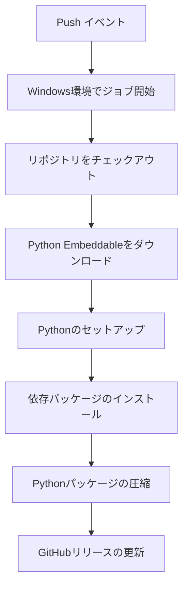

# Python オフライン配布パッケージビルダー

GitHub Actionsを使用してオフライン・スタンドアロンで動作するPythonパッケージを自動構築・配布するプロジェクトです。

## 🎯 プロジェクトの目的

このプロジェクトは以下の目的で作成されています：

- **オフライン環境**でのPython利用を可能にする
- **スタンドアロン**で動作する実行可能なPythonパッケージを配布
- **GitHub Actions**による自動化されたビルドプロセス
- **カスタマイズ可能**なパッケージ依存関係の管理

## 📦 配布されるパッケージについて

このプロジェクトでは、以下が含まれたPythonパッケージを配布します：

- **Python 3.13.7 (Embeddable版)**
- **pip** パッケージマネージャー
- **pandas** (デフォルト依存パッケージ)

配布されるパッケージは`Python_Embeddable.zip`として[Releases](https://github.com/toyfer/embeddable_python_init/releases/latest)からダウンロードできます。

## 🚀 使用方法

### 1. 配布パッケージのダウンロード

```bash
# 最新リリースから Python_Embeddable.zip をダウンロード
curl -L -o Python_Embeddable.zip https://github.com/toyfer/embeddable_python_init/releases/latest/download/Python_Embeddable.zip
```

### 2. パッケージの展開と実行

```bash
# Windows環境での例
unzip Python_Embeddable.zip -d Python/
cd Python/
python.exe -c "import pandas; print('Pandas version:', pandas.__version__)"
```

## 🔧 カスタマイズ方法

### 依存パッケージの追加・変更

`.github/workflows/init-python.yml`の以下の部分を編集してください：

```yaml
- name: Python Embeddable Setup Dependencies
  run: |
    .\Python\Python.exe -m pip install pandas
    # 追加したいパッケージをここに記載
    # .\Python\Python.exe -m pip install numpy matplotlib requests
```

### Pythonバージョンの変更

```yaml
- name: Python Embeddable Download
  run: Invoke-WebRequest -Uri https://www.python.org/ftp/python/3.13.7/python-3.13.7-embed-amd64.zip -Outfile Python.zip
  # ↑ URLを変更してバージョンを調整
```

## 🔄 GitHub Actions ワークフローの詳細

### ワークフローの概要

このプロジェクトのGitHub Actionsワークフロー（`.github/workflows/init-python.yml`）は以下の流れで動作します：



### 各ステップの詳細

#### 1. Check out code
```yaml
- name: Check out code
  uses: actions/checkout@v5
```
**役割**: リポジトリのソースコードをワークフロー実行環境にチェックアウトします。
- `actions/checkout@v5`: GitHub公式のアクションでリポジトリのコンテンツを取得

#### 2. Python Embeddable Download
```yaml
- name: Python Embeddable Download
  run: Invoke-WebRequest -Uri https://www.python.org/ftp/python/3.13.7/python-3.13.7-embed-amd64.zip -Outfile Python.zip
```
**役割**: Python.orgからPython 3.13.7のEmbeddable版をダウンロードします。
- Embeddable版は軽量でスタンドアロン実行に適した形式

#### 3. Python Embeddable Setup
```yaml
- name: Python Embeddable Setup
  run: |
    Expand-Archive .\Python.zip -DestinationPath .\Python\
    (Get-Content .\Python\Python313._pth) -replace '#import site', 'import site' | Set-Content .\Python\Python313._pth
    Invoke-WebRequest -Uri https://bootstrap.pypa.io/get-pip.py -Outfile .\Python\get-pip.py
    .\Python\Python.exe .\Python\get-pip.py
    .\Python\Python.exe -m pip install -U pip
```
**役割**: ダウンロードしたPythonの初期セットアップを実行します。
- ZIPファイルの展開
- `site`モジュールの有効化（サードパーティパッケージのインストールに必要）
- pipのインストール
- pipのアップグレード

#### 4. Python Embeddable Setup Dependencies
```yaml
- name: Python Embeddable Setup Dependencies
  run: |
    .\Python\Python.exe -m pip install pandas
```
**役割**: 指定した依存パッケージをインストールします。
- ここでパッケージを追加・変更することで、配布パッケージの内容をカスタマイズ可能

#### 5. Compress Python
```yaml
- name: Compress Python
  run: Compress-Archive -Path .\Python\* -DestinationPath .\Python_Embeddable.zip
```
**役割**: セットアップ完了したPythonを配布用にZIP圧縮します。

#### 6. Update Release
```yaml
- name: Update Release (always update latest release)
  uses: softprops/action-gh-release@v2
  with:
    tag_name: latest
    name: Python Embeddable with pandas
    # ... その他の設定
```
**役割**: GitHubリリースを作成・更新し、配布パッケージを公開します。
- `softprops/action-gh-release@v2`: GitHub Releasesを作成・更新するためのサードパーティアクション
- `tag_name: latest`で常に最新版として更新
- `make_latest: true`で最新リリースとしてマーク

## 🔐 必要な権限

ワークフローには以下の権限が設定されています：

```yaml
permissions:
  contents: write  # Release作成に必要
```

## 📝 ライセンス

このプロジェクトはMITライセンスのもとで公開されています。詳細は[LICENSE](LICENSE)ファイルをご確認ください。

## 🤝 コントリビューション

プルリクエストやIssueでのフィードバックを歓迎します。

## 📚 関連リンク

- [Python Embeddable Package](https://docs.python.org/3/using/windows.html#embedded-distribution)
- [GitHub Actions Documentation](https://docs.github.com/en/actions)